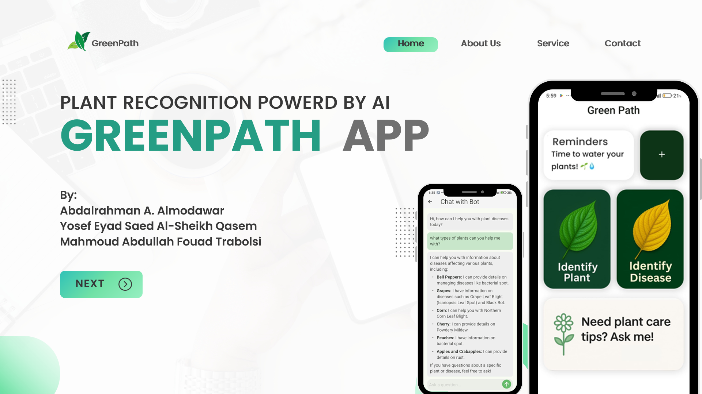

# 🌿 GreenPath - AI-Powered Plant Care Assistant

GreenPath is a mobile application that uses artificial intelligence to help users identify plants, diagnose plant diseases, get expert advice, and receive personalized watering reminders. Whether you're a plant enthusiast, a home gardener, or an outdoor adventurer, GreenPath is your go-to app for reliable, accessible, and efficient plant care.

---

## 🚀 Features

- 🌱 **Plant Identification**: Instantly identify plants using AI-powered image classification.
- 🌾 **Disease Detection**: Diagnose plant diseases with high accuracy through photo analysis.
- 💬 **Expert Chatbot**: Get 24/7 expert advice on plant care via an AI-powered chatbot.
- ⏰ **Watering Reminders**: Schedule personalized watering tasks with in-app notifications.
- 📱 **Offline Support**: All AI inference is performed on-device with TensorFlow Lite.
- 🖼️ **User-Friendly UI**: Intuitive green-themed design with simple navigation and clean interfaces.

---

## 🧠 AI & Model Architecture

GreenPath leverages deep learning models trained on the [PlantVillage dataset](https://www.kaggle.com/datasets/abdallahalidev/plantvillage-dataset/data) to provide highly accurate plant recognition and disease classification.

### 🔬 Experiments Summary

| Model           | Input Size | Accuracy | Parameters | Model Size |
|----------------|------------|----------|------------|-------------|
| CNN (Standard) | 100x100    | 98.02%   | 6.5M       | 25MB        |
| CNN + LSTM     | 100x100    | 98.53%   | 1.7M       | 7MB         |
| CNN (Standard) | 224x224    | 99.19%   | 51.6M      | 175MB       |
| CNN + LSTM     | 224x224    | 99.24%   | 71.5M      | 170MB       |

- Optimizer: Adamax  
- Loss: Sparse Categorical Crossentropy  
- Epochs: Up to 100 (early stopping)  
- Data Augmentation: Rotation, flipping, shifting, zooming, brightness

---

## 📱 Tech Stack

### 🖥️ Frontend
- **Flutter** (cross-platform mobile development)
- **Dart** for logic and UI
- Key Packages:
  - `tflite_flutter`
  - `image_picker`
  - `http`
  - `hive` (local DB)
  - `flutter_local_notifications`

### ⚙️ Backend
- **FastAPI** for chatbot API
- **Python** for AI models and backend services
- **TensorFlow / Keras** for ML training
- **OpenCV** for image preprocessing

---

## 📊 Evaluation Metrics

Each model was evaluated using:
- **Accuracy**
- **Precision**
- **Recall**
- **F1-Score**

Example (Best Model: CNN + LSTM @ 224x224):
- Accuracy: **99.24%**
- Precision: **0.99**
- Recall: **0.98**
- F1-score: **0.99**

---

## 🧩 System Design

- TensorFlow Lite models for on-device inference
- FastAPI-powered chatbot backend
- Flutter app with screens for:
  - Home
  - Plant Identification
  - Disease Diagnosis
  - Expert Chatbot
  - Add Reminder
  - Reminder List
- Local storage and notifications for offline support

---

## 📐 UML & UI Design

- UML Diagrams: Use Case, Sequence, Activity, Class
- UI Screens: Clean, minimal, and green-themed interface

---

## 📚 Related Work Comparison

| Feature             | GreenPath | Agrio | PlantSnap | PlantMinder |
|---------------------|-----------|-------|-----------|-------------|
| Plant Identification| ✅        | ✅    | ✅        | ❌          |
| Disease Detection   | ✅        | ✅    | ❌        | ❌          |
| Expert Chatbot      | ✅        | ❌    | ❌        | ❌          |
| Watering Reminders  | ✅        | ❌    | ❌        | ✅          |
| Community Sharing   | ❌        | ❌    | ✅        | ❌          |

---

## 🧑‍💻 Authors

- **Mahmoud Abdullah Fouad Trabolsi**  
- **Yosef Eyad Saed Al-Sheikh Qasem**  
> Final year project @ Jordan University of Science and Technology

---

## 📎 References

- PlantVillage Dataset: [Kaggle](https://www.kaggle.com/datasets/abdallahalidev/plantvillage-dataset/data)
- Mohanty et al., "Using Deep Learning for Image-Based Plant Disease Detection", *Frontiers in Plant Science*
- Agrio: https://agrio.app  
- PlantSnap: https://www.plantsnap.com  

---

## 📝 License

This project is for academic and educational purposes only. Contact the authors for reuse permissions or future collaboration.
